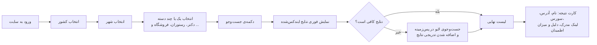

# ۰. نمای کلی

## مسئله

ایرانی‌های مهاجر یا مسافر معمولاً دنبال دکتر فارسی‌زبان، رستوران ایرانی، سوپرمارکت ایرانی، وکیل یا مشاور املاک ایرانی در شهرشان هستند. این اطلاعات در جاهای مختلف پخش شده است: Google Maps، اینستاگرام، فیس‌بوک، کانال‌های تلگرام و دایرکتوری‌های محلی. هیچ‌کدام هم فیلتری برای «ایرانی بودن» ندارند.

## راه‌حل

فارسی‌یاب این سورس‌ها را می‌گردد، کسب‌وکارهایی را که نشانه‌ی ایرانی یا فارسی‌زبان بودن دارند پیدا می‌کند و آن‌ها را در یک لیست یکپارچه نشان می‌دهد. **شفافیت** ویژگی اصلی محصول است: برای هر نتیجه، سورس و لینک مدرک نمایش داده می‌شود تا کاربر خودش بتواند ادعا را بررسی کند.

## کاربران

| نقش | نیاز |
|---|---|
| **کاربر عادی** | پیدا کردن سریع کسب‌وکار ایرانی در یک شهر و دسته‌ی مشخص |
| **صاحب کسب‌وکار** | ثبت یا اصلاح اطلاعات کسب‌وکار، یا درخواست حذف آن (فاز بعدی) |
| **ادمین** | بررسی نتایج مشکوک، مدیریت سورس‌ها و دسته‌ها، رسیدگی به گزارش‌ها |

## جریان اصلی کاربر



## نمونه‌ی کارت نتیجه

```
رستوران شیراز — Shiraz Kitchen                  اطمینان: بالا ●●●
📍 123 Yonge St, Toronto
🏷 رستوران
🔎 سورس‌ها: Facebook (از طریق Overture) · OpenStreetMap · Instagram · وب‌سایت

چرا ایرانی؟
  • دسته‌ی persian_restaurant در Overture Maps      ← [لینک صفحه‌ی فیس‌بوک]
  • برچسب cuisine=persian در OpenStreetMap        ← [لینک]
  • غذاهای ایرانی در منوی وب‌سایت (کوبیده، قرمه‌سبزی) ← [لینک]

[دیدن روی Google Maps]   [گزارش اشتباه]
```

## خارج از محدوده (فعلاً)

- رزرو، پرداخت یا سفارش آنلاین
- نظرات و امتیازدهی کاربران (در ابتدا فقط لینک به نظرات در سورس اصلی داده می‌شود)
- اپلیکیشن موبایل (سایت واکنش‌گرا کافی است)
