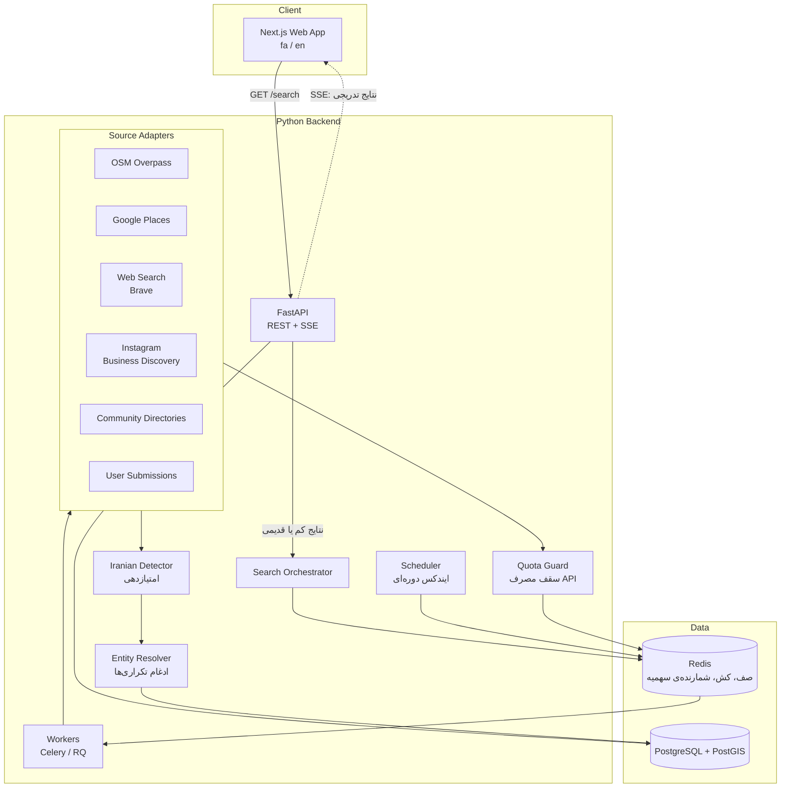

# ۲. معماری

## تصمیم اصلی: ایندکس از قبل + جست‌وجوی لایو

جست‌وجوی کاربر اول از **دیتابیس خودمان** جواب داده می‌شود. این دیتابیس را کراولرها در پس‌زمینه و به‌صورت دوره‌ای پر می‌کنند. فقط وقتی نتایج یک شهر و دسته کم یا قدیمی باشد، **جست‌وجوی لایو** انجام می‌شود. علت این انتخاب ([ADR-001](decisions/001-indexed-plus-live-search.md)):

- سهمیه‌ی رایگان API ها محدود است و نمی‌شود آن را برای هر سرچ کاربر خرج کرد
- جواب فوری است
- تشخیص ایرانی بودن (که چند مرحله دارد) یک بار انجام و ذخیره می‌شود

## اجزای سیستم



## جریان یک جست‌وجو

1. فرانت‌اند `GET /api/v1/search?country=CA&city=toronto&categories=restaurant,doctor` را صدا می‌زند.
2. API نتایج آن شهر و دسته‌ها را از PostgreSQL می‌خواند و فوراً برمی‌گرداند.
3. API برای هر جفت (شهر، دسته) وضعیت ایندکس را چک می‌کند:
   - اگر `last_indexed_at` قدیمی‌تر از **۷ روز** باشد یا تعداد نتایج کمتر از **۵** باشد، یک `search_job` ساخته و `job_id` برگردانده می‌شود.
4. فرانت‌اند به `GET /api/v1/search/jobs/{job_id}/stream` (Server-Sent Events) وصل می‌شود.
5. Worker ها آداپترهای فعال را **به‌صورت موازی** اجرا می‌کنند. خروجی هر آداپتر به ترتیب از Detector و Entity Resolver رد می‌شود، ذخیره می‌شود و به‌صورت رویداد SSE به کاربر می‌رسد.
6. بعد از اتمام همه‌ی آداپترها یا گذشت ۶۰ ثانیه، رویداد `done` ارسال می‌شود.

اگر همان شهر و دسته همزمان توسط کاربر دیگری در حال جست‌وجو باشد، job جدید ساخته نمی‌شود و کاربر دوم به همان job وصل می‌شود.

## ایندکس دوره‌ای

- Scheduler هر شب شهرهای فعال را به ترتیب اولویت (تعداد جست‌وجو و قدیمی بودن ایندکس) در صف می‌گذارد.
- سورس‌های رایگان و بدون سهمیه‌ی سخت‌گیرانه (مثل OSM) در همه‌ی شهرها اجرا می‌شوند.
- سورس‌های سهمیه‌دار (Google Places و Brave) بودجه‌ی ماهانه‌شان را بین شهرها تقسیم می‌کنند (بخش «مدیریت سهمیه» را ببینید).

## آداپتر سورس (رابط مشترک)

همه‌ی سورس‌ها یک رابط مشترک را پیاده‌سازی می‌کنند تا اضافه کردن سورس جدید فقط یک فایل جدید باشد:

```python
class SourceAdapter(Protocol):
    id: str                      # "osm", "google_places", ...
    cost_per_call: QuotaCost     # برای Quota Guard

    async def search(self, query: SearchQuery) -> AsyncIterator[RawListing]:
        """کسب‌وکارهای کاندید را برای (شهر، دسته) برمی‌گرداند."""

    async def enrich(self, listing: RawListing) -> RawListing:
        """(اختیاری) جزئیات بیشتر، مثل بیو، وب‌سایت یا منو."""
```

`RawListing` شامل نام، مختصات، آدرس، لینک‌ها، متن‌های خام (توضیحات، بیو، برچسب‌ها) و `source_url` است. Detector روی همین متن‌ها کار می‌کند.

## مدیریت سهمیه (Quota Guard)

با توجه به [NFR-1](01-requirements.md) (هزینه‌ی صفر):

- برای هر سورس یک شمارنده در Redis با کلید `quota:{source}:{YYYY-MM}` نگه داشته می‌شود.
- **قبل از** هر درخواست، شمارنده چک و به‌صورت اتمیک زیاد می‌شود. اگر از سقف گذشته باشد، آداپتر خطای `QuotaExhausted` می‌دهد و آن سورس تا ماه بعد رد می‌شود.
- سقف‌ها در کد، **۸۰٪ سهمیه‌ی رایگان** تنظیم می‌شوند تا حاشیه‌ی امن داشته باشیم.
- ۷۰٪ از بودجه برای ایندکس شبانه و ۳۰٪ برای جست‌وجوی لایو رزرو می‌شود.
- علاوه بر این، در کنسول هر سرویس هم سقف روزانه (quota limit) تنظیم می‌شود تا در صورت باگ، هزینه ایجاد نشود.

## Entity Resolution (ادغام تکراری‌ها)

یک رستوران ممکن است در OSM، Google و اینستاگرام پیدا شود. معیارهای ادغام:

1. شناسه‌ی مشترک (مثلاً وب‌سایت یا شماره‌تلفن نرمال‌شده با فرمت E.164)
2. فاصله‌ی کمتر از ۱۵۰ متر **و** شباهت نام بیشتر از ۰٫۸ (بعد از حذف کلماتی مثل Restaurant و Cafe و نویسه‌گردانی فارسی به لاتین)
3. لینک صریح (مثلاً وب‌سایت کسب‌وکار به اینستاگرامش لینک داده باشد)

نتیجه‌ی ادغام یک `business` با چند `source_record` و چند `evidence` است ([03](03-data-model.md)).

## ساختار ریپو (پیشنهادی)

```
FarsiYab/
├── apps/
│   └── web/                 # Next.js
├── services/
│   └── api/                 # FastAPI + workers
│       ├── farsiyab/
│       │   ├── adapters/    # یک فایل برای هر سورس
│       │   ├── detection/
│       │   ├── resolution/
│       │   ├── quota/
│       │   └── api/
│       └── tests/
├── data/                    # لیست شهرها، دسته‌ها، واژه‌نامه‌ها
├── docs/
└── docker-compose.yml       # postgres, redis, api, worker, web
```

## استقرار

- MVP روی یک VPS ارزان با Docker Compose
- PostgreSQL با افزونه‌های PostGIS و `pg_trgm` (برای شباهت نام)
- لاگ و مانیتورینگ مصرف سهمیه در پنل ادمین
