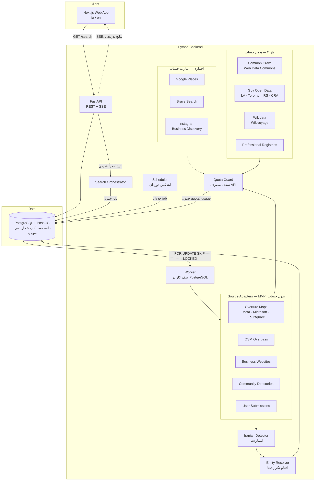

# ۲. معماری

## تصمیم اصلی: ایندکس از قبل + جست‌وجوی لایو

جست‌وجوی کاربر اول از **دیتابیس خودمان** جواب داده می‌شود. این دیتابیس را کراولرها در پس‌زمینه و به‌صورت دوره‌ای پر می‌کنند. فقط وقتی نتایج یک شهر و دسته کم یا قدیمی باشد، **جست‌وجوی لایو** انجام می‌شود. علت این انتخاب ([ADR-001](decisions/001-indexed-plus-live-search.md)):

- سهمیه‌ی رایگان API ها محدود است و نمی‌شود آن را برای هر سرچ کاربر خرج کرد
- جواب فوری است
- تشخیص ایرانی بودن (که چند مرحله دارد) یک بار انجام و ذخیره می‌شود

## اجزای سیستم



## جریان یک جست‌وجو

1. فرانت‌اند `GET /api/v1/search?country=CA&city=toronto&categories=restaurant,doctor` را صدا می‌زند.
2. API نتایج آن شهر و دسته‌ها را از PostgreSQL می‌خواند و فوراً برمی‌گرداند.
3. API وضعیت ایندکس **شهر** را چک می‌کند. ایندکس برای کل شهر انجام می‌شود، نه برای هر دسته، چون Overture و OSM کل محدوده‌ی شهر را یک‌جا برمی‌گردانند:
   - اگر شهر هرگز ایندکس نشده باشد یا `last_indexed_at` قدیمی‌تر از **۷ روز** باشد، یک ردیف در جدول `job` ساخته و `job_id` برگردانده می‌شود.
   - قانون قبلی «کمتر از ۵ نتیجه» حذف شد. با سورس‌های فایلی مثل Overture، ایندکس دوباره نتیجه‌ی جدیدی نمی‌دهد و فقط باعث تکرار بی‌فایده می‌شد.
4. فرانت‌اند به `GET /api/v1/search/jobs/{job_id}/stream` (Server-Sent Events) وصل می‌شود.
5. Worker ها آداپترهای فعال را **به‌صورت موازی** اجرا می‌کنند. خروجی هر آداپتر به ترتیب از Detector و Entity Resolver رد می‌شود، ذخیره می‌شود و به‌صورت رویداد SSE به کاربر می‌رسد.
6. بعد از اتمام همه‌ی آداپترها یا گذشت ۶۰ ثانیه، رویداد `done` ارسال می‌شود.

اگر برای همان شهر یک job در حال انتظار یا اجرا وجود داشته باشد، job جدید ساخته نمی‌شود (unique index جزئی روی `dedupe_key`) و کاربر دوم به همان job وصل می‌شود.

## صف کار (بدون Redis)

صف کار یک جدول ساده در PostgreSQL است (`job`):
- **ثبت:** `INSERT … ON CONFLICT DO NOTHING` روی `dedupe_key` (مثلاً `index_city:toronto`)
- **برداشتن:** Worker با `SELECT … FOR UPDATE SKIP LOCKED` یک job آماده برمی‌دارد. چند Worker همزمان هم job تکراری برنمی‌دارند.
- **تلاش دوباره:** اگر job خطا بدهد، `attempts` زیاد می‌شود و `run_after` با تأخیر نمایی عقب می‌رود. بعد از ۳ بار، وضعیت `failed` می‌شود.
- اجرای Worker با دستور `farsiyab worker` انجام می‌شود (روی سرور به‌صورت سرویس systemd).

## ایندکس دوره‌ای

> با [ADR-005](decisions/005-no-account-sources-first.md)، سورس اصلی Overture است که فایلی و **ماهانه** منتشر می‌شود. بنابراین:
> - **ایندکس ماهانه:** بعد از هر release جدید Overture، همه‌ی شهرهای فعال دوباره پردازش می‌شوند (هر شهر چند ثانیه طول می‌کشد).
> - **ایندکس هفتگی:** OSM و بررسی وب‌سایت کاندیدهای جدید.
> - **لایو:** وقتی کاربر شهری را جست‌وجو می‌کند که هنوز ایندکس نشده است (خواندن bbox آن شهر از Overture حدود ۲ ثانیه طول می‌کشد) یا برای بررسی وب‌سایت‌های نتایجی که هنوز بررسی نشده‌اند.

- Scheduler هر شب شهرهای فعال (برای OSM و وب‌سایت‌ها) را به ترتیب اولویت (تعداد جست‌وجو و قدیمی بودن ایندکس) در صف می‌گذارد.
- سورس‌های رایگان و بدون سهمیه‌ی سخت‌گیرانه (مثل OSM) در همه‌ی شهرها اجرا می‌شوند.
- سورس‌های اختیاری سهمیه‌دار (Google Places و Brave، در صورت فعال شدن) بودجه‌ی ماهانه‌شان را بین شهرها تقسیم می‌کنند (بخش «مدیریت سهمیه» را ببینید).

## آداپتر سورس (رابط مشترک)

تعریف همه‌ی سورس‌ها (شناسه، نوع، لایسنس، وضعیت، فاز، نشانه‌ها و ...) در [`data/sources.yaml`](../data/sources.yaml) است و هنگام راه‌اندازی در جدول `source` بارگذاری می‌شود. هر آداپتر با `id` خودش به همان تعریف وصل می‌شود.

همه‌ی سورس‌ها یک رابط مشترک را پیاده‌سازی می‌کنند تا اضافه کردن سورس جدید فقط یک فایل جدید باشد:

```python
# services/api/farsiyab/adapters/base.py
class SourceAdapter(Protocol):
    id: str                      # همان id در data/sources.yaml

    def fetch(self, city: CityInfo) -> Iterator[RawListing]:
        """همه‌ی مکان‌های کاندید در bbox شهر."""
```

`RawListing` شامل نام، مختصات، آدرس، دسته (نگاشت‌شده به دسته‌های ما)، تلفن‌ها، لینک‌ها، متن‌های خام (`TextField`) و نشانه‌های ساختاریافته‌ی خاص همان سورس (مثل `osm_cuisine_tag`) است. Detector روی همین‌ها کار می‌کند.

بررسی وب‌سایت (`adapters/website.py`) آداپتر کشف نیست. بعد از آداپترها، برای کاندیدهای دارای وب‌سایت اجرا می‌شود (async، با رعایت `robots.txt` و محدودیت نرخ برای هر host).

## پیاده‌سازی (فاز ۱)

| مرحله | فایل |
|---|---|
| خواندن سورس‌ها | `farsiyab/adapters/overture.py`، `osm.py`، `website.py` |
| تشخیص | `farsiyab/detection/` (واژه‌نامه‌ها در `data/lexicons/`) |
| نرمال‌سازی لینک‌ها | `farsiyab/links.py` |
| ادغام | `farsiyab/resolution.py` |
| ایندکس یک شهر | `farsiyab/indexer.py` |
| صف و سهمیه | `farsiyab/jobs.py`، `farsiyab/quota.py` |
| API | `farsiyab/api.py` |
| CLI | `farsiyab/cli.py` (`farsiyab index`، `worker`، `serve`، `db init`) |

## مدیریت سهمیه (Quota Guard)

با توجه به [NFR-1](01-requirements.md) (هزینه‌ی صفر):

- برای هر سورس و هر ماه یک ردیف در جدول `quota_usage(source_id, period, used)` نگه داشته می‌شود.
- **قبل از** هر درخواست، شمارنده با یک `UPDATE … SET used = used + 1 WHERE used < cap RETURNING` به‌صورت اتمیک چک و زیاد می‌شود. اگر از سقف گذشته باشد، آداپتر خطای `QuotaExhausted` می‌دهد و آن سورس تا ماه بعد رد می‌شود.
- سقف‌ها در کد، **۸۰٪ سهمیه‌ی رایگان** تنظیم می‌شوند تا حاشیه‌ی امن داشته باشیم.
- ۷۰٪ از بودجه برای ایندکس شبانه و ۳۰٪ برای جست‌وجوی لایو رزرو می‌شود.
- علاوه بر این، در کنسول هر سرویس هم سقف روزانه (quota limit) تنظیم می‌شود تا در صورت باگ، هزینه ایجاد نشود.

## Entity Resolution (ادغام تکراری‌ها)

یک رستوران ممکن است در OSM، Google و اینستاگرام پیدا شود. معیارهای ادغام:

1. شناسه‌ی مشترک (مثلاً وب‌سایت یا شماره‌تلفن نرمال‌شده با فرمت E.164)
2. فاصله‌ی کمتر از ۱۵۰ متر **و** شباهت نام بیشتر از ۰٫۸ (بعد از حذف کلماتی مثل Restaurant و Cafe و نویسه‌گردانی فارسی به لاتین)
3. لینک صریح (مثلاً وب‌سایت کسب‌وکار به اینستاگرامش لینک داده باشد)

نتیجه‌ی ادغام یک `business` با چند `source_record` و چند `evidence` است ([03](03-data-model.md)).

## ساختار ریپو

```
FarsiYab/
├── apps/
│   └── web/                 # Next.js: src/app/[lang]/، src/components/، e2e/
├── services/
│   └── api/                 # FastAPI + workers
│       ├── farsiyab/
│       │   ├── adapters/    # یک فایل برای هر سورس
│       │   ├── detection/
│       │   ├── resolution.py, indexer.py, jobs.py, quota.py, links.py
│       │   └── api.py, cli.py
│       ├── migrations/      # Alembic
│       └── tests/
├── data/                    # لیست شهرها، دسته‌ها، واژه‌نامه‌ها
├── deploy/                  # systemd، Caddyfile و راهنمای نصب سرور
├── research/                # اسکریپت‌های بررسی سورس‌ها (مثل overture_probe.py)
├── scripts/                 # setup_db.sh: ساخت دیتابیس و فعال‌سازی PostGIS
└── docs/
```

## استقرار (بدون Docker)

پروژه از Docker استفاده نمی‌کند. همه‌ی سرویس‌ها مستقیم روی سیستم‌عامل نصب می‌شوند.

**توسعه‌ی محلی**
- **تنها سرویسی که باید نصب شود PostgreSQL 16 + PostGIS است** (`apt` در لینوکس، `brew` در مک، و در ویندوز installer رسمی PostgreSQL با StackBuilder برای PostGIS). Redis و Docker لازم نیستند.
- بک‌اند: Python با محیط مجازی (`uv` یا `venv`)
- فرانت‌اند: Node.js LTS و `npm`
- `scripts/setup_db.sh` دیتابیس و کاربر را می‌سازد، افزونه‌های `postgis` و `pg_trgm` را فعال می‌کند و migration ها را اجرا می‌کند
- مراحل نصب در README ریپو نوشته می‌شود

**سرور (VPS)**
- همان نصب مستقیم روی Ubuntu LTS
- هر سرویس یک unit در systemd دارد (`farsiyab-api`، `farsiyab-worker`، `farsiyab-scheduler` و `farsiyab-web`). فایل‌ها در `deploy/systemd/` هستند.
- Caddy به‌عنوان reverse proxy و برای HTTPS خودکار
- آپدیت سرور: `git pull`، نصب وابستگی‌ها، اجرای migration ها و `systemctl restart`
- PostgreSQL با افزونه‌های PostGIS و `pg_trgm` (برای شباهت نام)
- لاگ و مانیتورینگ مصرف سهمیه در پنل ادمین
