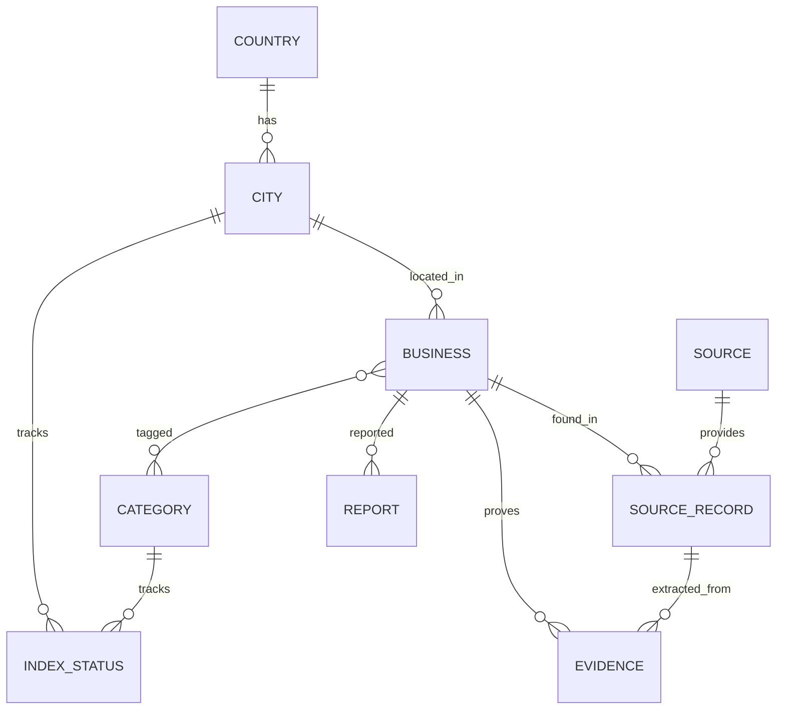

# ۳. مدل داده

## جدول‌ها

### `country`
| ستون | نوع | توضیح |
|---|---|---|
| code | char(2) PK | کد ISO 3166-1، مثل `CA` |
| name_fa, name_en | text | |
| enabled | bool | |

### `city`
| ستون | نوع | توضیح |
|---|---|---|
| id | serial PK | |
| geonames_id | int unique | شناسه در GeoNames |
| country_code | FK | |
| name_fa, name_en, slug | text | |
| center | geography(Point) | |
| bbox | geography(Polygon) | محدوده‌ی جست‌وجو (برای Overpass و Places) |
| enabled | bool | |

### `category`
| ستون | نوع | توضیح |
|---|---|---|
| slug | text PK | مثل `restaurant` |
| name_fa, name_en | text | |
| parent_slug | FK nullable | زیردسته، مثل `doctor/dentist` |
| source_mappings | jsonb | نگاشت به نوع‌های هر سورس ([06](06-categories-and-locations.md)) |

### `business`
| ستون | نوع | توضیح |
|---|---|---|
| id | uuid PK | |
| city_id | FK | |
| name_fa, name_latin | text | |
| address | text | |
| location | geography(Point) nullable | |
| phone_e164, website, email | text | فقط اطلاعات عمومی کسب‌وکار |
| confidence_score | real | ۰ تا ۱؛ خروجی Detector |
| confidence_label | enum | `high`, `medium`, `low` |
| status | enum | `active`, `hidden`, `removed_by_request`, `closed` |
| first_seen_at, last_verified_at | timestamptz | |

### `source`
| ستون | نوع | توضیح |
|---|---|---|
| id | text PK | `osm`، `google_places`، `brave_search`، `instagram`، `facebook`، `directory:<name>`، `user_submission` |
| display_name_fa, display_name_en | text | همان چیزی که کاربر در بخش «سورس‌ها» می‌بیند |
| enabled | bool | |
| monthly_quota | int nullable | |

### `source_record`
یک ردیف برای هر بار که یک کسب‌وکار در یک سورس دیده شده است.

| ستون | نوع | توضیح |
|---|---|---|
| id | uuid PK | |
| business_id | FK | |
| source_id | FK | |
| external_id | text | مثل `node/123` در OSM، `place_id` در Google یا نام‌کاربری اینستاگرام |
| url | text | **لینکی که به کاربر نشان داده می‌شود** |
| raw | jsonb nullable | داده‌ی خام؛ **فقط برای سورس‌هایی که ذخیره‌اش مجاز است** (برای Google خالی می‌ماند، [google-places.md](sources/google-places.md) را ببینید) |
| fetched_at | timestamptz | |
| unique(source_id, external_id) | | |

### `evidence`
مدرک ایرانی بودن. **این جدول هسته‌ی شفافیت محصول است.**

| ستون | نوع | توضیح |
|---|---|---|
| id | uuid PK | |
| business_id | FK | |
| source_record_id | FK | مدرک از کجا آمده |
| signal | enum | نوع نشانه ([04](04-iranian-detection.md))، مثل `persian_script_name`، `explicit_keyword`، `osm_cuisine_tag` |
| weight | real | وزن این نشانه در امتیاز |
| snippet | text | متن کوتاهی که نشانه در آن پیدا شده (حداکثر ۲۰۰ کاراکتر) |
| url | text | لینک صفحه‌ای که مدرک در آن دیده شده |
| detected_at | timestamptz | |

### `index_status`
| ستون | نوع | توضیح |
|---|---|---|
| city_id, category_slug | PK | |
| last_indexed_at | timestamptz | |
| result_count | int | |
| per_source | jsonb | وضعیت هر سورس: زمان آخرین اجرا، تعداد نتیجه، خطا |

### `search_job`
| ستون | نوع | توضیح |
|---|---|---|
| id | uuid PK | |
| city_id, categories | | |
| status | enum | `queued`, `running`, `done`, `failed` |
| created_at, finished_at | | |

### `report`
| ستون | نوع | توضیح |
|---|---|---|
| id | uuid PK | |
| business_id | FK | |
| reason | enum | `not_iranian`, `closed`, `wrong_info`, `remove_request` |
| message | text | |
| contact_email | text nullable | فقط برای درخواست حذف |
| status | enum | `open`, `resolved`, `rejected` |

## ایندکس‌های دیتابیس
- `business(city_id, status)`، ایندکس GIST روی `location`، ایندکس `gin_trgm_ops` روی `name_latin` و `name_fa`
- `business_category(category_slug, business_id)`
