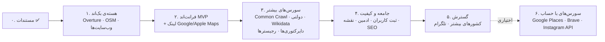

# ۸. نقشه‌ی راه

هر فاز یک **معیار اتمام** دارد که قابل تست است. سورس‌های هر فاز از [`data/sources.yaml`](../data/sources.yaml) (فیلد `phase`) می‌آیند. **فازهای ۰ تا ۵ هیچ حساب کاربری، کلید یا کارت بانکی لازم ندارند** ([ADR-005](decisions/005-no-account-sources-first.md)).

## فاز ۰: مستندسازی ✅
- مستندات محصول، معماری و مدل داده
- کاتالوگ ۲۷ سورس ([sources/](sources/README.md) + [`data/sources.yaml`](../data/sources.yaml)) و سورس‌های ردشده با دلیل
- تصمیم‌های اصلی (ADR-001 تا ADR-005)
- تست واقعی Overture روی تورنتو ([`research/overture_probe.py`](../research/overture_probe.py))

## فاز ۱: هسته‌ی بک‌اند و سورس‌های MVP
**زیرساخت**
- [ ] ساختار ریپو (`services/api`)، `scripts/setup_db.sh` (Postgres + PostGIS)، راهنمای نصب محلی در README، CI (lint + test)
- [ ] مدل داده و migration ها (Alembic)
- [ ] بارگذاری `data/sources.yaml` در جدول `source`، و `data/categories.yaml`
- [ ] کشورها و شهرهای MVP از GeoNames، و bbox شهرها از Nominatim

**سورس‌ها** (رابط `SourceAdapter`)
- [ ] `overture`: خواندن bbox شهر از آخرین release
- [ ] `osm`: کوئری Overpass
- [ ] `website`: بررسی صفحه‌ی اول وب‌سایت کاندیدها (با robots.txt و محدودیت نرخ)
- [ ] استخراج لینک‌های `facebook` و `instagram` از خروجی سه سورس بالا

**پردازش**
- [ ] Iranian Detector، واژه‌نامه‌ها در `data/lexicons/` و تست با مثبت‌های کاذب واقعی (فرش‌فروشی‌ها، Shirazi، پشتو و اردو)
- [ ] Entity Resolver (ادغام تکراری‌های Overture، OSM و وب‌سایت)
- [ ] ذخیره‌ی `evidence` با snippet و لینک

**API و ابزار**
- [ ] `GET /api/v1/search`، `/countries`، `/cities`، `/categories`
- [ ] CLI: `farsiyab index <city> [--categories …]`

**معیار اتمام:** دستور `farsiyab index toronto` بدون هیچ کلیدی اجرا شود و `GET /search?city=toronto&categories=restaurant` نتایجی با سورس، لینک مدرک و امتیاز اطمینان برگرداند.

## فاز ۲: فرانت‌اند MVP
- [ ] Next.js با i18n (فارسی RTL و انگلیسی) و فونت Vazirmatn
- [ ] صفحه‌ی اصلی: انتخاب کشور، شهر و دسته‌ها و دکمه‌ی جست‌وجو
- [ ] صفحه‌ی نتایج: کارت نتیجه (سورس‌ها، مدارک، اطمینان، «دیدن روی Google Maps / Apple Maps»)
- [ ] اتصال SSE برای ایندکس لایو شهرهای جدید
- [ ] دکمه‌ی گزارش اشتباه
- [ ] صفحه‌های «درباره»، «نحوه‌ی جمع‌آوری داده» و «حریم خصوصی»
- [ ] استقرار اولیه روی VPS (systemd + Caddy، فایل‌ها در `deploy/`)

**معیار اتمام:** یک کاربر واقعی از موبایل، تورنتو و رستوران را انتخاب کند و نتایج را با مدرک و لینک ببیند.

## فاز ۳: سورس‌های بیشتر (بدون حساب)
- [ ] بررسی ToS و `robots.txt` **۱۹ دایرکتوری ایرانی** و ارسال ایمیل پیشنهاد همکاری
- [ ] آداپتر دایرکتوری‌های تأییدشده
- [ ] بررسی رجیسترها (CPSO، CalBar، Texas Bar، BDÜ و ...) و انتخاب حالت «داده» یا «لینک»
- [ ] `gov:*`: مجوزهای LA، تورنتو و ونکوور؛ IRS و CRA برای دسته‌ی `community`
- [ ] `common_crawl`: کشف ماهانه‌ی سایت‌های فارسی‌زبان
- [ ] `wdc_schemaorg`: رستوران‌های با `servesCuisine = Persian`
- [ ] `wikidata` و `wikivoyage`
- [ ] دسته‌های جدید: `accounting`، `education`، `community`، `translator`
- [ ] Scheduler: Overture ماهانه، OSM و وب‌سایت‌ها هفتگی، دایرکتوری‌ها هفتگی

**معیار اتمام:** برای هر شهر MVP، حداقل ۳ سورس مستقل نتیجه بدهند. گزارش مقایسه‌ی پوشش هر سورس در `docs/reports/` ثبت شود.

## فاز ۴: جامعه و کیفیت
- [ ] فرم ثبت کسب‌وکار و درخواست حذف یا اصلاح
- [ ] پنل ادمین: صف بررسی، گزارش‌ها، وضعیت سورس‌ها
- [ ] برچسب‌گذاری ۳۰۰ نمونه و تنظیم وزن‌های Detector
- [ ] نمایش روی نقشه (Leaflet + OSM)
- [ ] صفحه‌های SEO شهر و دسته

**معیار اتمام:** دقت (precision) Detector روی نمونه‌های برچسب‌خورده حداقل ۹۰٪ در برچسب‌های «بالا» و «متوسط».

## فاز ۵: گسترش
- [ ] کشورها و شهرهای بیشتر (انگلستان، سوئد، استرالیا، هلند، فرانسه، ترکیه، امارات و ...) با تنظیم آستانه‌های جدا
- [ ] دایرکتوری‌های کشورهای جدید (کاندیدهای انگلستان و استرالیا از قبل شناسایی شده‌اند)
- [ ] لینک کانال‌های تلگرام
- [ ] ادعای مالکیت کسب‌وکار (claim) توسط صاحبش

## فاز ۶: سورس‌های اختیاری با حساب
فقط در صورتی که حساب‌ها ساخته شوند؛ معماری تغییری نمی‌کند:
- [ ] Google Places API (با Quota Guard)
- [ ] Brave Search API
- [ ] Instagram Business Discovery
- [ ] UK Companies House
