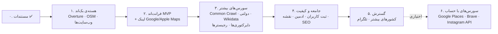

# ۸. نقشه‌ی راه

هر فاز یک **معیار اتمام** دارد که قابل تست است. سورس‌های هر فاز از [`data/sources.yaml`](../data/sources.yaml) (فیلد `phase`) می‌آیند. **فازهای ۰ تا ۵ هیچ حساب کاربری، کلید یا کارت بانکی لازم ندارند** ([ADR-005](decisions/005-no-account-sources-first.md)).

## فاز ۰: مستندسازی ✅
- مستندات محصول، معماری و مدل داده
- کاتالوگ ۲۷ سورس ([sources/](sources/README.md) + [`data/sources.yaml`](../data/sources.yaml)) و سورس‌های ردشده با دلیل
- تصمیم‌های اصلی (ADR-001 تا ADR-005)
- تست واقعی Overture روی تورنتو ([`research/overture_probe.py`](../research/overture_probe.py))

## فاز ۱: هسته‌ی بک‌اند و سورس‌های MVP ✅
راهنمای اجرا: [`services/api/README.md`](../services/api/README.md)

**زیرساخت**
- [x] ساختار ریپو (`services/api`)، `scripts/setup_db.sh` (Postgres + PostGIS)، راهنمای نصب، CI (lint + test) در `.github/workflows/ci.yml`
- [x] مدل داده و migration ها (Alembic)
- [x] بارگذاری `data/sources.yaml` در جدول `source`، و `data/categories.yaml`
- [x] کشورها و ۱۰ شهر MVP از `data/cities.yaml` (GeoNames و Nominatim به فاز ۵ منتقل شدند)
- [x] صف کار و سهمیه در خود PostgreSQL (بدون Redis)

**سورس‌ها** (رابط `SourceAdapter`)
- [x] `overture`: خواندن bbox شهر از آخرین release (**تست‌شده روی داده‌ی واقعی**)
- [x] `osm`: کوئری Overpass (با تست روی داده‌ی ضبط‌شده؛ شبکه‌ی محیط توسعه به Overpass دسترسی ندارد)
- [x] `website`: بررسی صفحه‌ی اول وب‌سایت کاندیدها (robots.txt، محدودیت نرخ، تلاش دوباره فقط برای خطاهای شبکه)
- [x] استخراج لینک‌های `facebook`، `instagram` و `telegram`

**پردازش**
- [x] Iranian Detector، واژه‌نامه‌ها در `data/lexicons/` و تست با مثبت‌های کاذب واقعی (فرش‌فروشی‌ها، Shirazi، پشتو، اردو، Bastani، Caspian و ...)
- [x] Entity Resolver (رکورد یکسان، لینک مشترک، یا فاصله‌ی کمتر از ۱۵۰ متر + نام مشابه)
- [x] ذخیره‌ی `evidence` با snippet و لینک

**API و ابزار**
- [x] `GET /api/v1/search`، `/countries`، `/cities`، `/categories`، `/search/jobs/{id}`، `POST /businesses/{id}/reports`
- [x] CLI: `farsiyab db init`، `index <city>`، `worker`، `serve`، `cities`
- [x] ۱۱۱ تست (واحد + دیتابیس واقعی PostGIS)

**معیار اتمام:** دستور `farsiyab index toronto` بدون هیچ کلیدی اجرا شود و `GET /search?city=toronto&categories=restaurant` نتایجی با سورس، لینک مدرک و امتیاز اطمینان برگرداند. ✅ **انجام شد** (نتایج در [reports/phase1-first-index.md](reports/phase1-first-index.md)).

## فاز ۲: فرانت‌اند MVP ✅
راهنما: [`apps/web/README.md`](../apps/web/README.md) و راه‌اندازی سرور: [`deploy/README.md`](../deploy/README.md)

- [x] Next.js 16 با دو زبان (فارسی RTL پیش‌فرض و انگلیسی)، تشخیص زبان از مرورگر، و فونت Vazirmatn
- [x] صفحه‌ی اصلی: انتخاب کشور، شهر و دسته‌ها (چندانتخابی) و دکمه‌ی جست‌وجو
- [x] صفحه‌ی نتایج: کارت نتیجه (سورس‌ها، «چرا ایرانی؟»، اطمینان، «بررسی در Google Maps / Apple Maps / OSM»)، مرتب‌سازی، فیلتر اطمینان، صفحه‌بندی
- [x] SSE (`/search/jobs/{id}/stream`): شهر ایندکس‌نشده در پس‌زمینه ایندکس می‌شود و نتایج خودکار به‌روز می‌شوند
- [x] دکمه‌ی گزارش اشتباه (همراه با درخواست حذف)
- [x] صفحه‌های «درباره»، «نحوه‌ی کار» و «حریم خصوصی»
- [x] فایل‌های استقرار روی VPS: systemd، Caddy (تست‌شده)، راهنمای نصب
- [x] ۱۲ تست end-to-end با Playwright (دسکتاپ و موبایل) و CI برای سایت
- [ ] **استقرار واقعی روی سرور:** نیاز به VPS و دامنه دارد

**معیار اتمام:** یک کاربر واقعی از موبایل، تورنتو و رستوران را انتخاب کند و نتایج را با مدرک و لینک ببیند. ✅ در تست‌های end-to-end (نمای موبایل Pixel 7) انجام شد. فقط استقرار روی سرور واقعی باقی مانده است.

## فاز ۳: سورس‌های بیشتر (بدون حساب)
- [ ] بررسی ToS و `robots.txt` **۱۹ دایرکتوری ایرانی** و ارسال ایمیل پیشنهاد همکاری
- [ ] آداپتر دایرکتوری‌های تأییدشده
- [ ] بررسی رجیسترها (CPSO، CalBar، Texas Bar، BDÜ و ...) و انتخاب حالت «داده» یا «لینک»
- [ ] `gov:*`: مجوزهای LA، تورنتو و ونکوور؛ IRS و CRA برای دسته‌ی `community`
- [ ] `common_crawl`: کشف ماهانه‌ی سایت‌های فارسی‌زبان
- [ ] `wdc_schemaorg`: رستوران‌های با `servesCuisine = Persian`
- [x] `wikidata` و `wikivoyage`: کد و تست با داده‌ی ضبط‌شده ✅؛ **اجرا روی داده‌ی واقعی باقی مانده** (شبکه‌ی محیط توسعه بسته است)
- [ ] دسته‌های جدید: `accounting`، `education`، `community`، `translator`
- [x] Scheduler: `farsiyab schedule` روزانه با systemd timer؛ شهرهای ایندکس‌نشده، قدیمی‌تر از ۷ روز، یا ایندکس‌شده با release قدیمی Overture را در صف می‌گذارد
- [x] گزارش پوشش: `farsiyab coverage --markdown` (معیار اتمام این فاز)

**معیار اتمام:** برای هر شهر MVP، حداقل ۳ سورس مستقل نتیجه بدهند. گزارش مقایسه‌ی پوشش هر سورس در `docs/reports/` ثبت شود.

## فاز ۴: جامعه و کیفیت
- [ ] فرم ثبت کسب‌وکار و درخواست حذف یا اصلاح
- [ ] پنل ادمین: صف بررسی، گزارش‌ها، وضعیت سورس‌ها
- [ ] برچسب‌گذاری ۳۰۰ نمونه و تنظیم وزن‌های Detector
- [ ] نمایش روی نقشه (Leaflet + OSM)
- [ ] صفحه‌های SEO شهر و دسته

**معیار اتمام:** دقت (precision) Detector روی نمونه‌های برچسب‌خورده حداقل ۹۰٪ در برچسب‌های «بالا» و «متوسط».

## فاز ۵: گسترش
- [ ] کشورها و شهرهای بیشتر (انگلستان، سوئد، استرالیا، هلند، فرانسه، ترکیه، امارات و ...) با تنظیم آستانه‌های جدا
- [ ] دایرکتوری‌های کشورهای جدید (کاندیدهای انگلستان و استرالیا از قبل شناسایی شده‌اند)
- [ ] لینک کانال‌های تلگرام
- [ ] ادعای مالکیت کسب‌وکار (claim) توسط صاحبش

## فاز ۶: سورس‌های اختیاری با حساب
فقط در صورتی که حساب‌ها ساخته شوند؛ معماری تغییری نمی‌کند:
- [ ] Google Places API (با Quota Guard)
- [ ] Brave Search API
- [ ] Instagram Business Discovery
- [ ] UK Companies House
